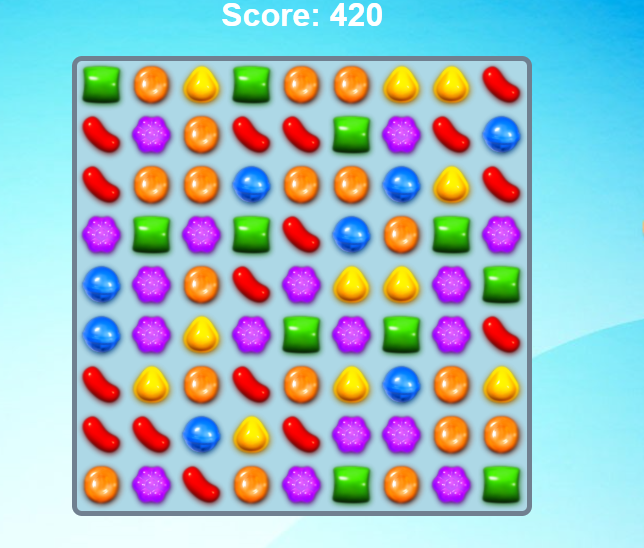

# 🍬 Candy Crush Game
## A fun and fully functional Candy Crush-inspired game built using HTML, CSS, and vanilla JavaScript. It features a thematic background that captures the colorful and playful essence of the original Candy Crush game.

# 🔧 Technologies Used
## - HTML5
### Builds the game board structure, the candy elements, and control buttons.
## - CSS3
### Handles the visual design of the game, with a bright, animated, and colorful style that mirrors the Candy Crush universe.
## - JavaScript (vanilla)
### Implements the full game logic: candy swapping, match detection, scoring system, and candy refilling after matches.

# 🎮 How It Works
## The game board is a grid of candies (usually 8x8 or 10x10), where each cell represents a different candy type.
## Players can swap two adjacent candies.
## If the swap results in a line of three or more matching candies (horizontal or vertical), those candies are removed, and new ones fall into place.
## Each valid match increases the player's score, and the game continues until the player reaches a goal or runs out of time (depending on how it's set up).

# 💡 Game Features
## Detects 3, 4, or 5 matching candies in a row or column.

## Dynamic board updates after matches.
## Scoring system.
## Smooth animations and responsive gameplay experience.
## Thematic background with candies, soft pastel colors, and cartoon-style visuals.

# 🎨 Design & User Experience
## Light and responsive UI with smooth animations for candy swaps and matches.
## Candy icons styled with gradients, shadows, and rounded edges.
## Background includes sweet-themed visuals like clouds, floating candies, or colorful patterns.
## Fully playable on both desktop and mobile browsers.

  

